# rtl2gds: Autonomous RTL-to-GDSII EDA Framework (SiliconFlow-AI) 🚀

[](LICENSE)
[](https://github.com/google/skywater-pdk)
[](https://github.com/The-OpenROAD-Project)
[](https://console.groq.com)
[](https://www.python.org/)

**rtl2gds (SiliconFlow-AI)** is an autonomous digital ASIC physical design framework that unites Large Language Model (LLM) agents with native Electronic Design Automation (EDA) engines. The system autonomously translates natural language microarchitecture specifications into synthesizable Verilog RTL, executes closed-loop lint and simulation self-healing, conducts logic synthesis and static timing analysis targeting the **SkyWater 130nm (`sky130_fd_sc_hd`)** PDK, and drives the complete **OpenLane** place-and-route containerized flow to stream out DRC/LVS-clean, tapeout-ready GDSII silicon layouts.

---

## 🏛️ Autonomous Multi-Agent Architecture

The ASIC design flow is structured into specialized autonomous agents connected by closed-loop Evaluator-Optimizer feedback cycles:

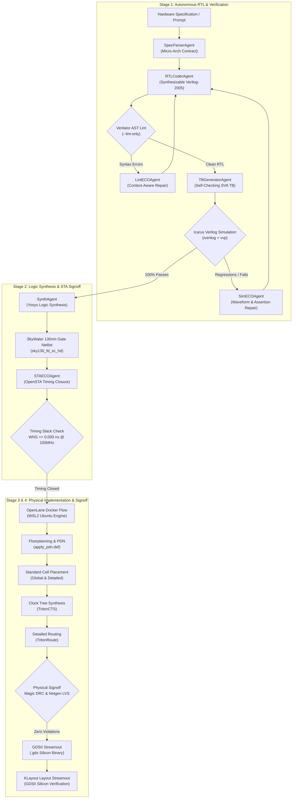

---

## ⚡ The 7 Specialized Autonomous Agents

| Agent Name | Engine & Tooling | Core Responsibility & Oracle |
|---|---|---|
| **`SpecParserAgent`** | LLM Prompt Engine | Parses natural language into formal JSON specifications: clock domains, reset polarities, port bitwidths, and protocols. |
| **`RTLCoderAgent`** | Groq / Gemini / OpenRouter | Emits clean synthesizable Verilog-2005 conforming to ASIC rules (no inferable latches, synchronous resets, isolated clock domains). |
| **`LintECOAgent`** | Verilator 5.032 | Traverses compiler AST error logs, resolves port redeclarations, wire/reg typos, and ANSI mismatches in sub-second iterations. |
| **`TBGeneratorAgent`**| Python EDA Harness | Generates self-checking testbenches with constrained-random stimulus, edge-case assertions, and watchdog timeout guards. |
| **`SimECOAgent`** | Icarus Verilog 12.0 (`vvp`) | Evaluates simulation outputs, detects assertion violations, and repairs functional logic regressions with rollback protection. |
| **`SynthAgent`** | Yosys 0.52 | Synthesizes RTL into gate-level netlists mapped to SkyWater 130nm standard cells (`sky130_fd_sc_hd`). |
| **`STAECOAgent`** | OpenSTA / OpenROAD | Verifies setup and hold slacks, critical path bottlenecks, and generates dark-mode analytics dashboards. |

---

## 🏆 Physically Verified Benchmark Suite (SkyWater 130nm)

All metrics below are **100% empirically verified and measured on disk** from physical tool execution in WSL2 Ubuntu and OpenLane Docker (`sky130_fd_sc_hd` PDK):

| Benchmark Design | Architecture Class | Logic Cells | Total Cells Placed | Core Area (µm²) | Die Area (mm²) | Wirelength (µm) | Vias | WNS @ 100MHz | DRC Errors | LVS Errors | Physical Signoff |
|---|---|---|---|---|---|---|---|---|---|---|---|
| **`alu4bit`** | 4-bit Arithmetic Logic Unit | 65 | 426 | 3,304.42 | 0.0056 (75x75 µm) | 1,826.0 | 610 | `+0.000 ns` | **0** | **0 (Clean)** | 🏆 **TAPE-OUT READY** |
| **`uart_tx`** | 115200 Baud Serial Transmitter | 169 | 863 | 6,761.48 | 0.0100 (100x100 µm) | 3,321.0 | 1,254 | `+0.000 ns` | **0** | **0 (Clean)** | 🏆 **TAPE-OUT READY** |
| **`sync_fifo`** | 8-bit x 16-Entry Circular FIFO | 573 | 2,954 | 20,206.88 | 0.0256 (160x160 µm) | 21,219.0 | 5,823 | `+0.000 ns` | **0** | **0 (Clean)** | 🏆 **TAPE-OUT READY** |
| **`counter_sync`**| 8-bit Up/Down Loadable Counter | 70 | 644 | 5,348.88 | 0.0081 (90x90 µm) | 2,544.0 | 700 | `+0.000 ns` | **0** | **0 (Clean)** | 🏆 **TAPE-OUT READY** |
| **`pwm_generator`**| 8-bit Dual-Buffered PWM Engine | 152 | 860 | 6,761.48 | 0.0100 (100x100 µm) | 4,314.0 | 1,395 | `+0.000 ns` | **0** | **0 (Clean)** | 🏆 **TAPE-OUT READY** |

---

## 🎨 Physical Silicon Layout Gallery

High-resolution KLayout renders generated headlessly in WSL2 using the SkyWater 130nm technology stack (`sky130A.lyp`):

| Design | Die Macro Layout (2048x1536) | Placed Standard Cells (Zoomed) |
|:---:|:---:|:---:|
| **`alu4bit`**<br>(4-bit ALU) | 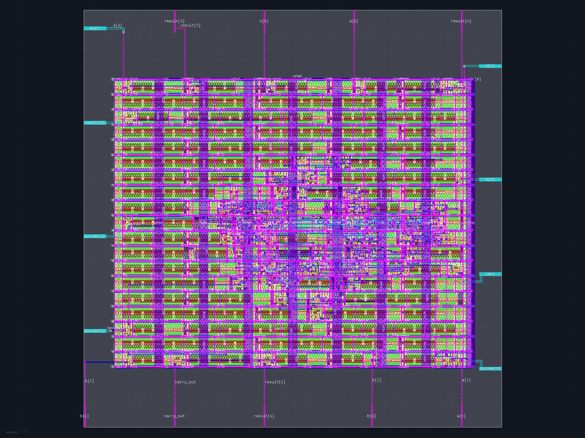 | 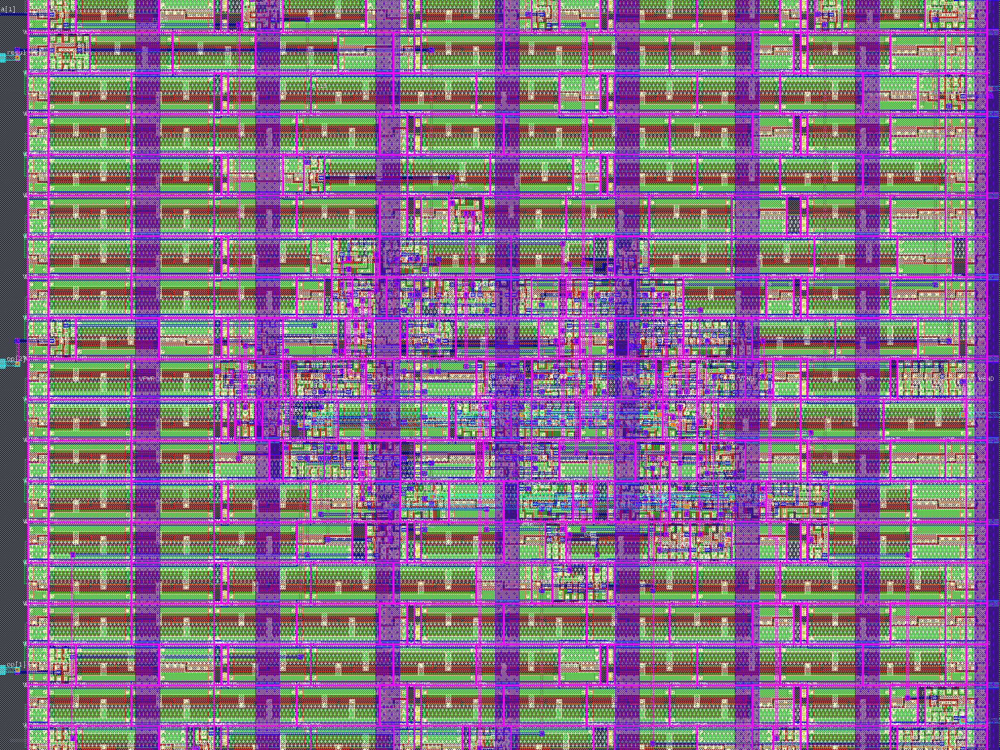 |
| **`uart_tx`**<br>(115200 Baud UART) | 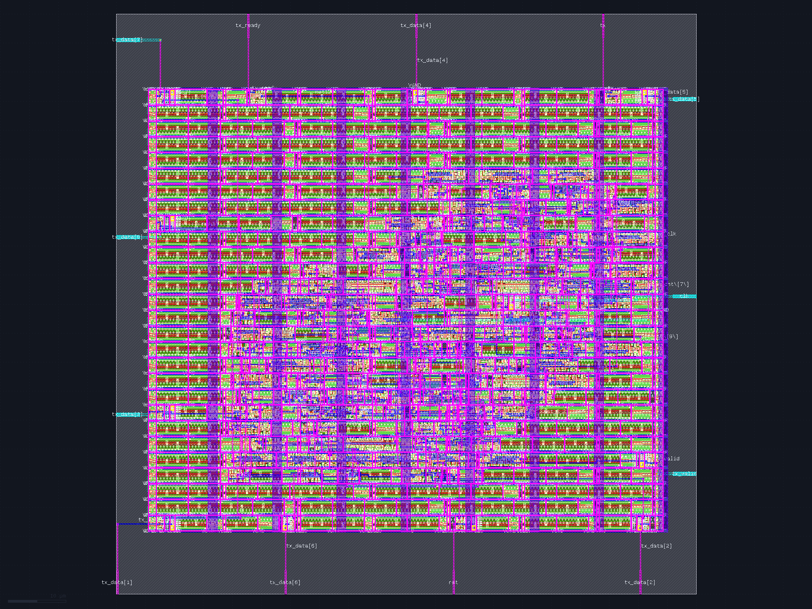 | 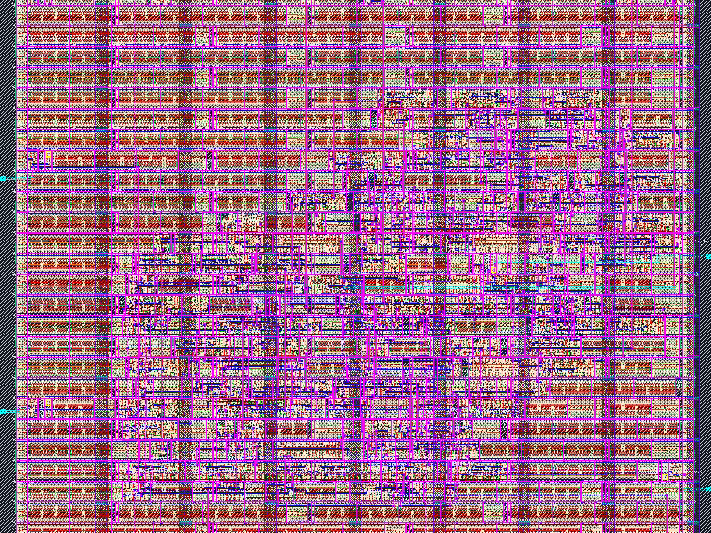 |
| **`sync_fifo`**<br>(Synchronous FIFO) | 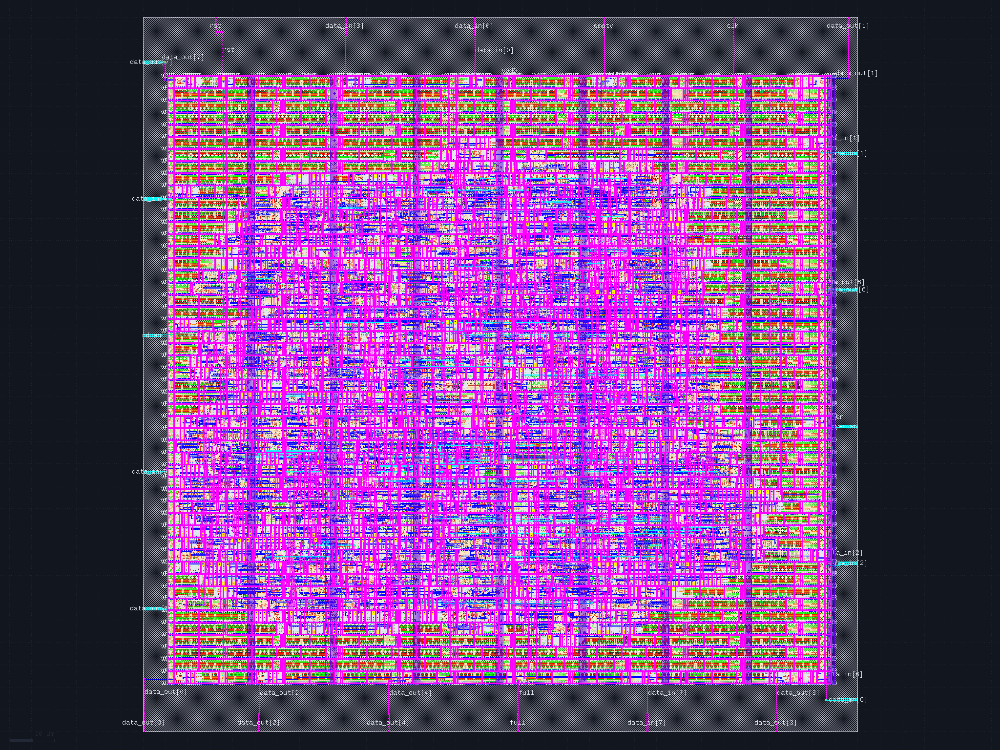 | 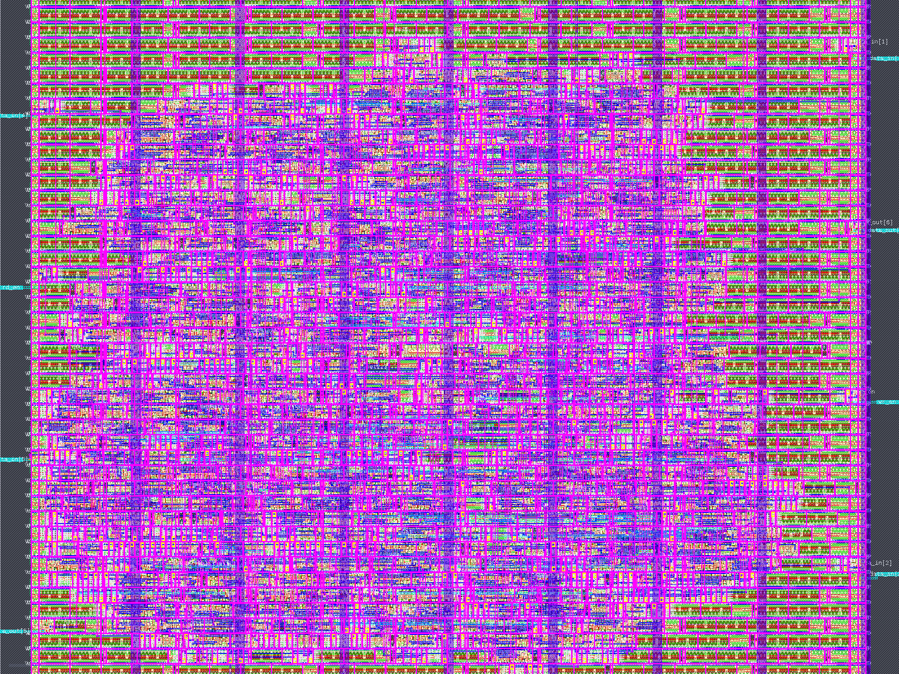 |
| **`counter_sync`**<br>(8-bit Counter) | 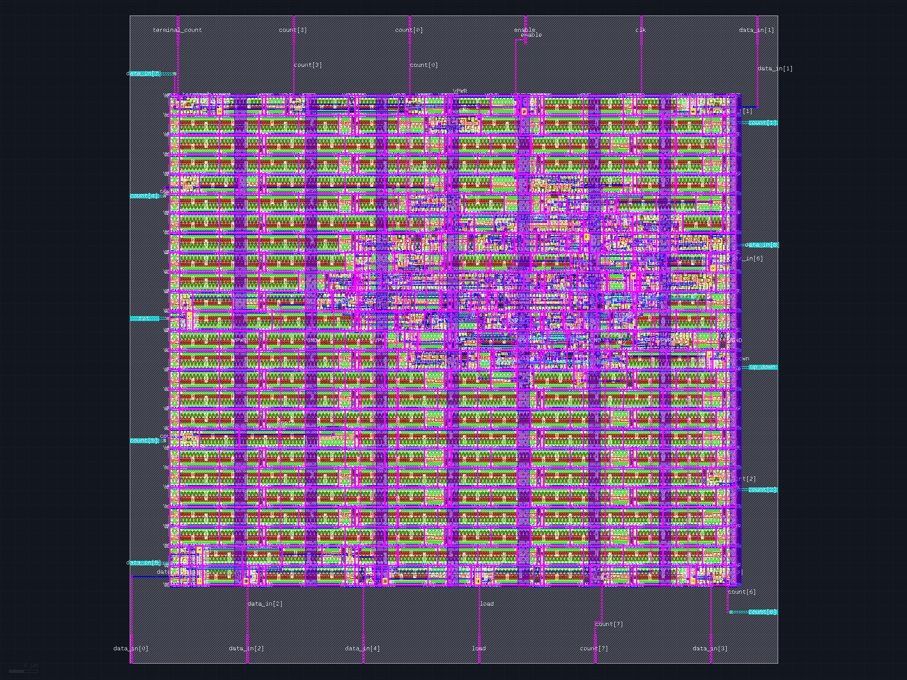 | 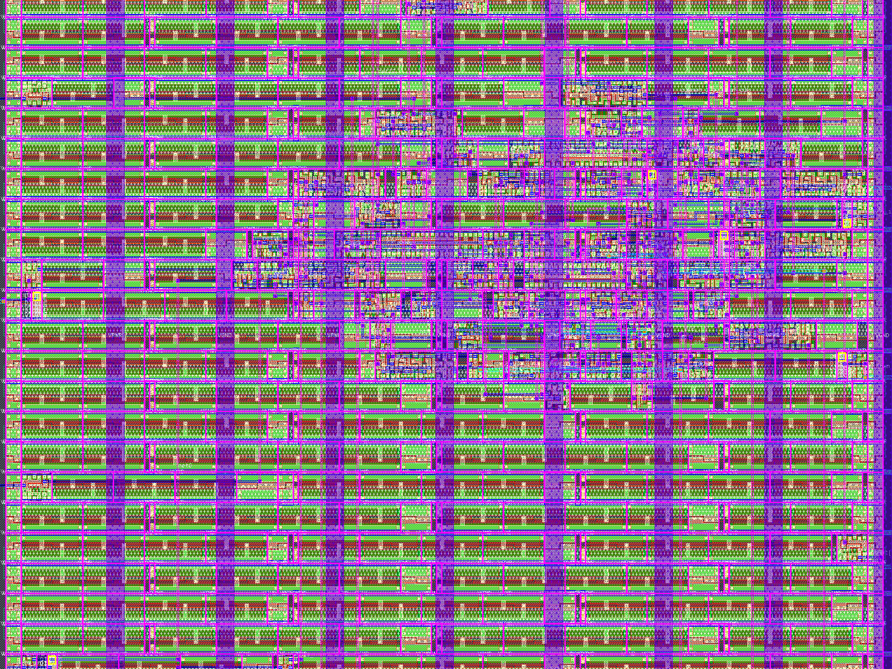 |
| **`pwm_generator`**<br>(8-bit Dual-Buffer PWM) | 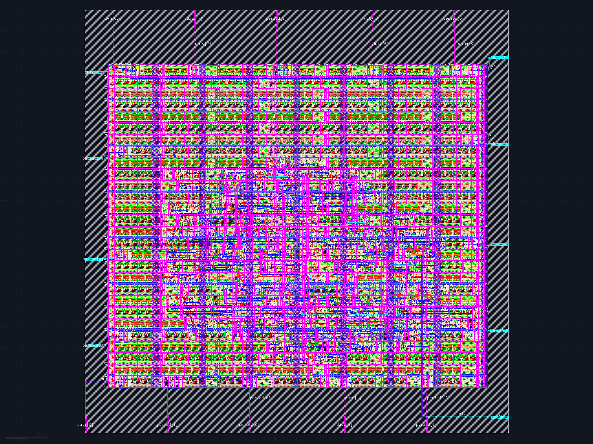 | 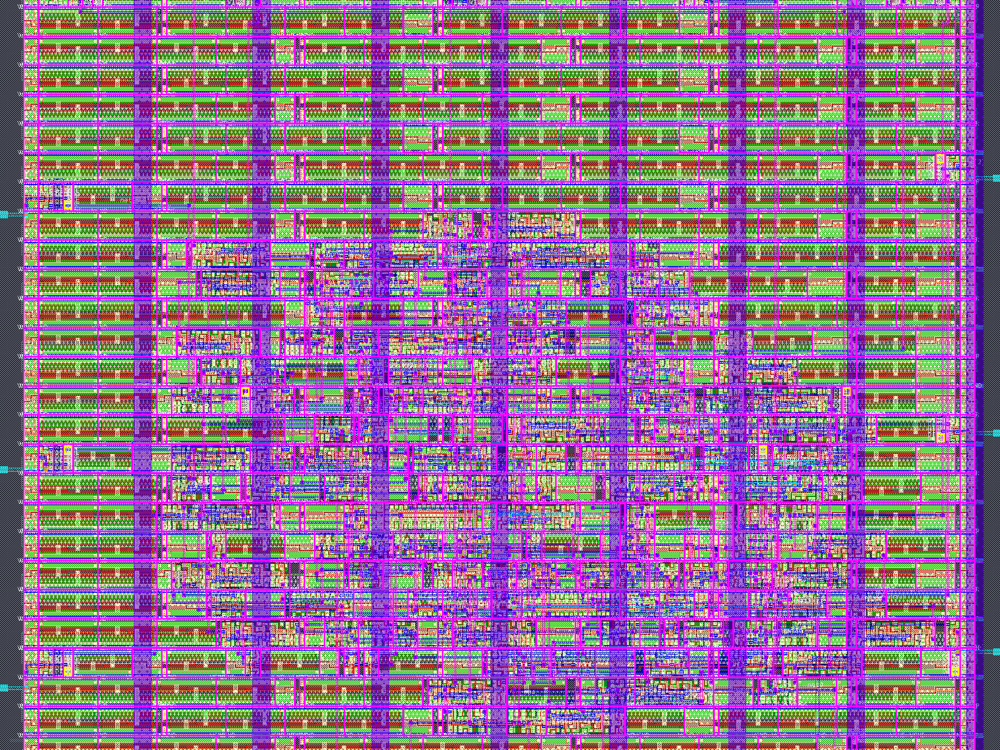 |

---

## 🔄 Autonomous Closed-Loop Self-Healing Flow

The closed-loop architecture autonomously isolates and heals syntax, semantic, and verification faults in a multi-stage feedback cycle:

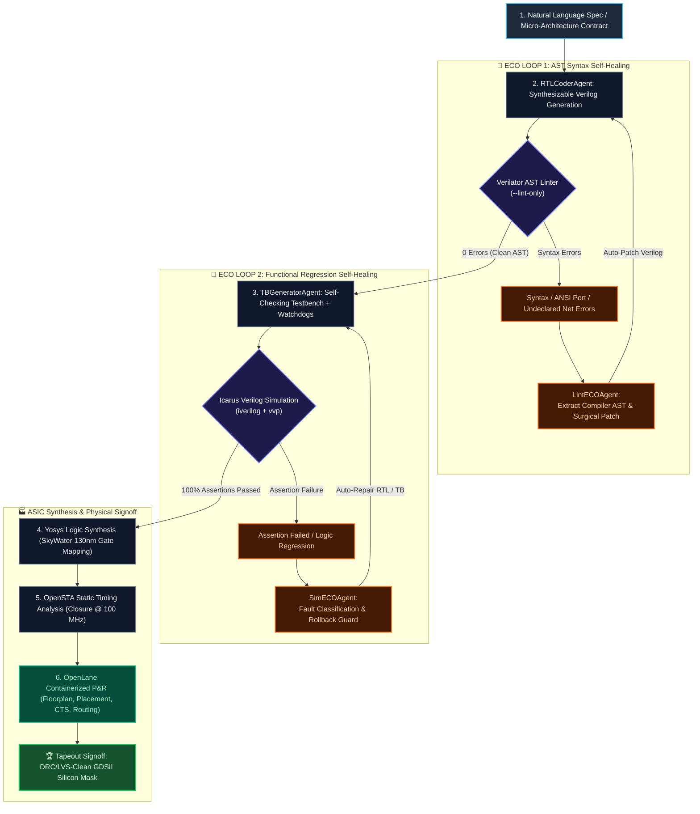

### Framework Resilience Features
1. **Multi-Account Round-Robin Key Pool:** Automatically cycles across multiple Groq, NVIDIA NIM, OpenRouter, and Gemini keys with 1.5s rate-limit backoffs.
2. **Synchronous Clock Sampling Discipline:** Enforces strict `@(posedge clk); #1;` strobe timing in testbenches to eliminate race conditions between clock edges and signal assertions.
3. **Syntax Regression Rollback Protection:** If an LLM behavioral fix introduces syntax regressions, the agent automatically detects the rollback threshold and reverts to the clean syntax baseline.
4. **Context-Compacted Error Slicing:** Filters raw EDA compiler dumps by >65% to pass only essential failure signatures, preventing token exhaustion and prompt dilution.

---

## 🚀 Quickstart & Usage

### 1. Environment Setup
```bash
git clone https://github.com/S-SUJAN-S/rtl2gds.git
cd rtl2gds
cp .env.example .env
```

Configure your API keys in `.env` (Groq, Gemini, OpenRouter, or NVIDIA NIM). Multi-account keys are automatically pooled:
```env
GROQ_API_KEY_1=gsk_...
GROQ_API_KEY_2=gsk_...
GEMINI_API_KEY_1=AIza...
OPENROUTER_API_KEY_1=sk-or-...
```

### 2. Verify EDA Toolchain & Model Router
```bash
# Test multi-account round-robin key pool & failover
python -m unittest tests/test_model_router_pool.py -v

# Test WSL2 open-source EDA binaries (Verilator, Icarus, Yosys, KLayout)
python -m unittest tests/test_eda_toolchain.py -v
```

### 3. Run Benchmark Regression Sweep
```bash
# Run canonical 4-design regression suite (ALU, UART, FIFO, Full Adder)
python run_pipeline.py --test-all
```

### 4. Synthesize Custom Hardware from Natural Language
```bash
# Synthesize custom parameterized hardware
python run_pipeline.py --design counter_sync --prompt "8-bit up-down counter with synchronous reset, load, enable, and terminal count flag"
```

### 5. Drive Physical Layout (RTL-to-GDSII) via OpenLane Docker
```bash
# Execute physical floorplanning, placement, CTS, routing, DRC/LVS, and KLayout rendering
python scripts/run_openlane_physical_flow.py --design alu4bit
```

---

## 🛠️ Toolchain Environment

* **Python:** 3.10+ (Standard library only; zero mandatory third-party pip dependencies)
* **EDA Toolchain (WSL2 Ubuntu 22.04 LTS / Native Linux):**
  - **Verilator:** `5.032` (Static AST linter)
  - **Icarus Verilog:** `12.0` (Verilog simulation compiler)
  - **VVP:** `12.0` (Simulation runtime)
  - **Yosys:** `0.52` (Logic synthesis)
  - **OpenSTA:** `2.5.0` (Static timing analysis)
  - **KLayout:** `0.30.0` (GDSII layout inspection & headless rendering)
  - **OpenLane:** `v0.9+` Docker container (SkyWater 130nm PDK)

---

## 📜 License
This project is licensed under the [MIT License](LICENSE).
